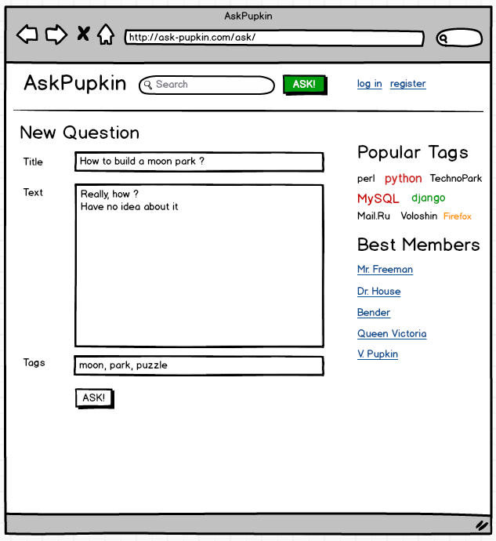
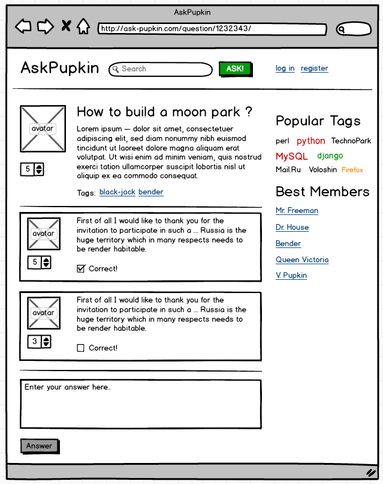

<!DOCTYPE html>

<html>
<body>

Проект представляет собой 
сервис ответов на вопросы. Пользователь сервиса имеет возможность 
зарегистрироваться, задать вопрос, ответить на вопросы других 
пользователей. Так же пользователь может отметить вопросы с помощь 
кнопки "лайк", изменяя их рейтинг. Прототип-образц - <a rel="nofollow" href="http://stackoverflow.com/">http://stackoverflow.com/</a> 
<h2>Основные сущности проекта</h2>

<ol><li>Пользователь - email, имя, пароль, аватарка </li><li>Вопрос - заголовок, текст, автор, рейтинг вопроса</li><li>Ответ - текст, вопрос, автор, флаг "правильности"</li><li>Лайк - вопрос,&nbsp;пользователь</li></ol><h2>Формы и страницы проекта </h2>
Главная страница

URL: &nbsp;/

Назначение:
 представляет из себя список "популярных" вопросов. В списке выводятся 
вопросы за последнюю неделю в порядке убывания рейтинга.

Список новых вопросов

URL: /new/ 

Назначение: список вопросов по дате их добавления начиная с самого свежего.

Страница одного вопроса 

URL: /question/123/ 

Назначение:
 на этой странице можно прочитать текст вопрос и список ответов к нему. 
Авторизованные пользователи могут добавить свой ответ. 

Страница регистрации 

URL: /signup/

Назначение: пользователь может ввести свой email, пароль, имя, выбрать аватарку и зарегистрироваться в проекте 

Страница авторизации

URL: /login/ 

Назначение: пользователь может ввести email и пароль и авторизоваться (войти) в проекте.

Страница добавления вопроса 

URL: /ask/

Назначение: авторизованный пользователь может задать вопрос, после чего перейдет на страницу этого вопроса. 
<h2>Примерный дизайн</h2><h2><b></b></h2><h2><b></b> <b></b> </h2>
<b></b>
<h2>AJAX&nbsp;запросы</h2>


URL: /like/123/ 

Назначение:
 пользователь может нажать&nbsp;кнопку&nbsp;"Лайк" 
у&nbsp;вопроса&nbsp;и&nbsp;это&nbsp;увеличит&nbsp;рейтинг&nbsp;вопроса. 
Пользователь&nbsp;может&nbsp;ставить&nbsp;"лайк" не&nbsp;более 
&nbsp;1&nbsp;раза&nbsp;для&nbsp;1&nbsp;вопроса.

</body></html>